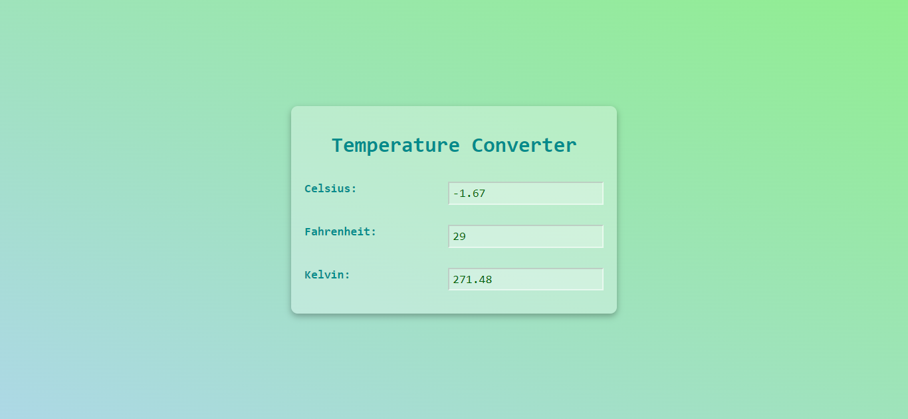

# Simple-Temperature-Converter-with-Plain-HTML-CSS-JavaScript
Here we build a very simple temperature converter, converting temperature between Celsius, Fahrenheit, and Kelvin; using pure HTML, CSS, and JS

